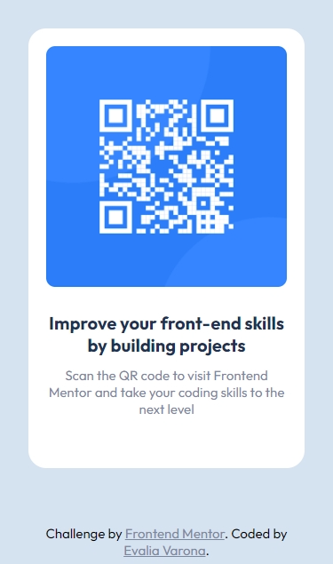
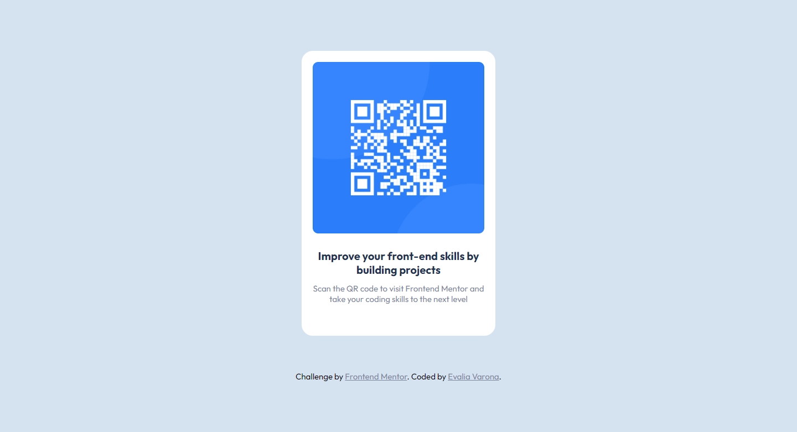

# Frontend Mentor - QR code component solution

This is a solution to the [QR code component challenge on Frontend Mentor](https://www.frontendmentor.io/challenges/qr-code-component-iux_sIO_H). Frontend Mentor challenges help you improve your coding skills by building realistic projects. 

## Table of contents

- [Frontend Mentor - QR code component solution](#frontend-mentor---qr-code-component-solution)
  - [Table of contents](#table-of-contents)
  - [Overview](#overview)
    - [Screenshot](#screenshot)
    - [Links](#links)
  - [My process](#my-process)
    - [Built with](#built-with)
    - [What I learned](#what-i-learned)
    - [Continued development](#continued-development)
    - [Useful resources](#useful-resources)
  - [Author](#author)

## Overview

### Screenshot

### Links

- Solution URL: [Github Repository](https://github.com/varonalearns/QR-code-component)
- Live Site URL: [Vercel Live Site](https://qr-code-component-sand.vercel.app/)

## My process

### Built with

- Semantic HTML5 markup
- CSS custom properties
- Flexbox
- Mobile-first workflow

### What I learned

Beyond putting everything that I have learned about HTML and CSS, I did a little research on how to properly write a git commit message. I still think I need to work on it.

### Continued development

In future projects, I want to work on getting better at writing git commit messages. 

### Useful resources

- [How to Write Good Git Commit Messages](https://chiamakaikeanyi.dev/how-to-write-good-git-commit-messages/) - This article helped me to better write git commit messages so that they serve a purpose and make sense for anyone (or myself) looking back on this project. 

## Author

- Website - [Evalia Varona](https://www.evaliavarona.com)
- Frontend Mentor - [@varonalearns](https://www.frontendmentor.io/profile/varonalearns)
